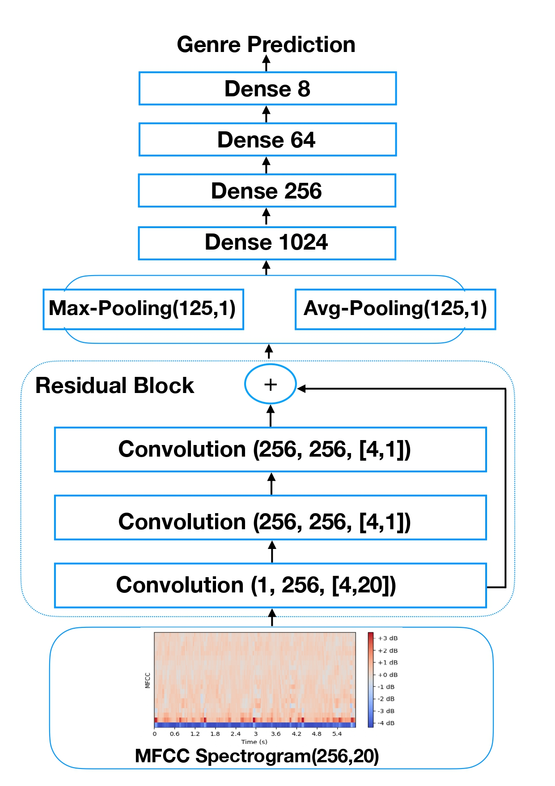

# Music Genre Recognition with Convolutional Neural Networks

We present a deep learning approach to solve the music genre classification task using the [FMA dataset](https://github.com/mdeff/fma).

## 1D CNN
Convolutional neural network using 1D audio clips as input data.

  

## 2D CNN 
Residual Convolutional neural network using 2D spectrograms as input data.

  

## MixNet 
This arichtecture was created by combining the convolutional blocks of the previous networks. It thus extracts and exploits information from both 1D audio signals and 2D spectrograms.

  

