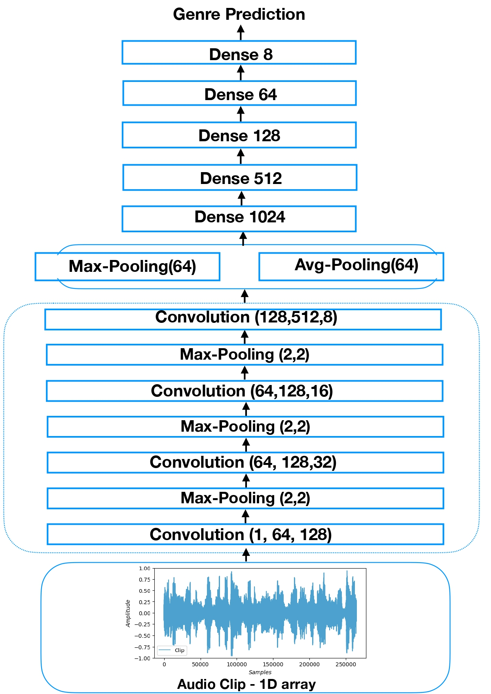
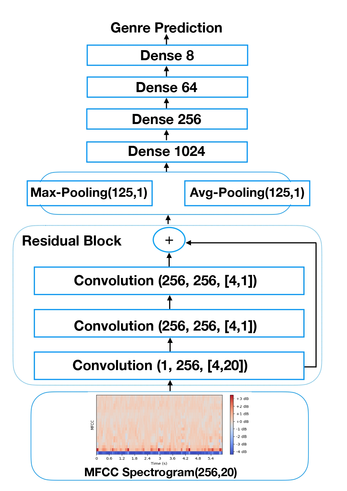
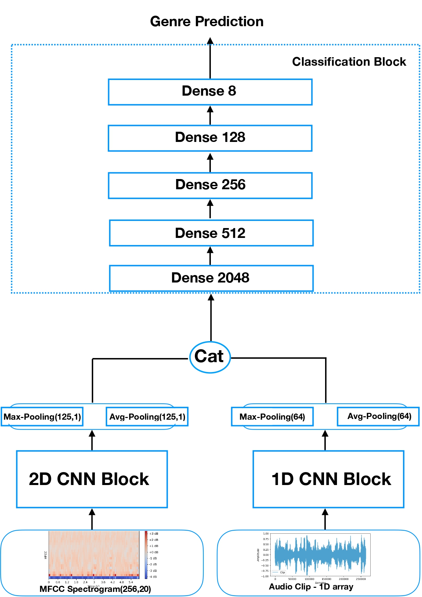

# Music Genre Recognition with Convolutional Neural Networks

In this project, three neural networks architecture were implemented and tested to solve the music genre classification task.

## 1D CNN
Convolutional neural network using 1D audio clips as input data.

## 2D CNN 
Residual Convolutional neural network using 2D spectrograms as input data.

## MixNet 
This arichtecture was created by combining the convolutional blocks of the previous networks. It thus extracts and exploits information from both 1D audio signals and 2D spectrograms.

